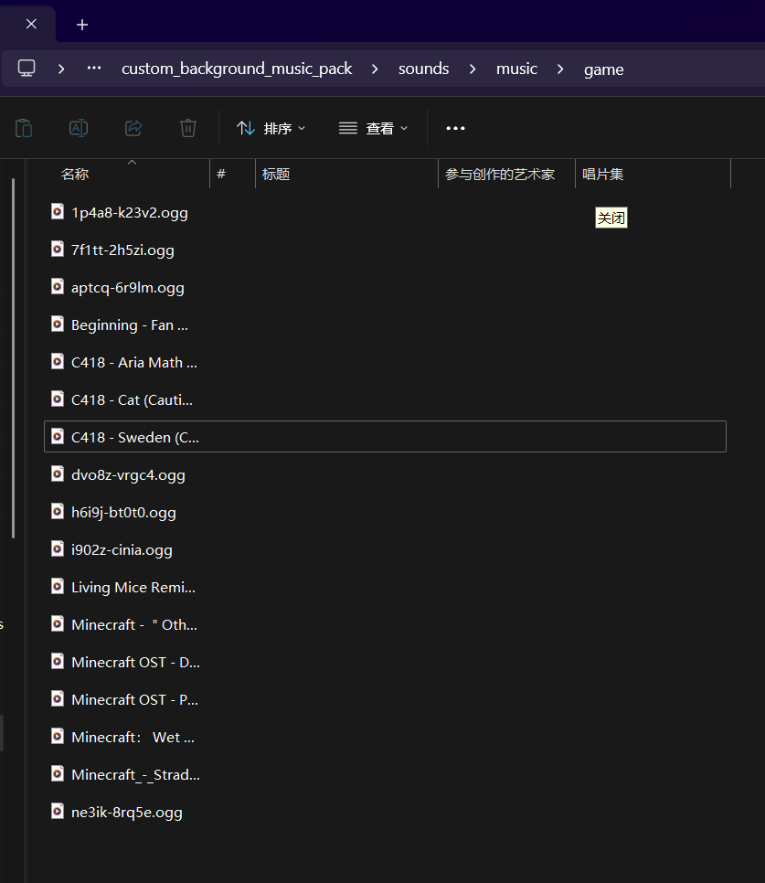
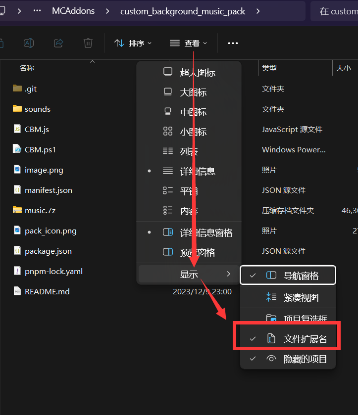

# Custom MCB Background Music
自定义我的世界基岩版背景音乐资源包

## Usage

### 系统要求：
- nodejs > 14
or
- powershell > 7

### 使用步骤

- 如果没有自定义需求，直接双击`custom_music.mcpack`来安装，然后在游戏里装载。已经内涵了17首还不错的Minecraft风格的音乐集

- 如果有自己定制需求，按照以下步骤来：

#### 1.删除`sounds/music/game/`下的所有音频文件

#### 2.准备自己的music音频文件
准备音频文件，音频格式为`.ogg`
音频类型转换网站：https://convertio.co/zh/mp4-ogg/

#### 3.将ogg文件放入`/sounds/music/game/`目录下
如下目录：

#### 4.执行powershell脚本或者js脚本

windows在包的根目录下执行powershell脚本：
> .\CBM.ps1

或者执行js脚本：
> node .\CBM.js

#### 5.打包当前目录下的sounds、manifest.json、pack_icon.png文件

选中`sounds`文件夹、`manifest.json`文件、以及`pack_icon.png`文件
然后右键选择压缩为zip，然后更改压缩文件名为：`custom_music.mcpack`
这里要注意
把文件扩展名打开来改
